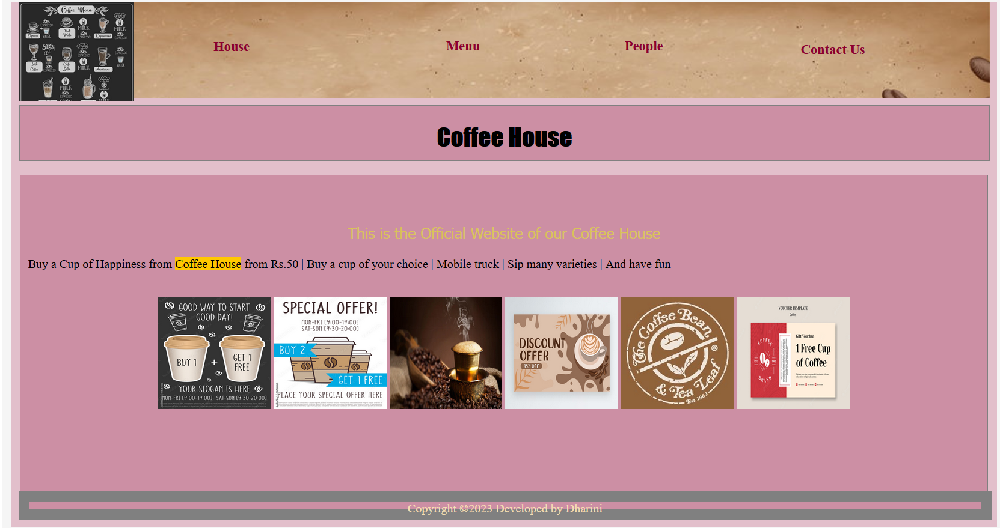
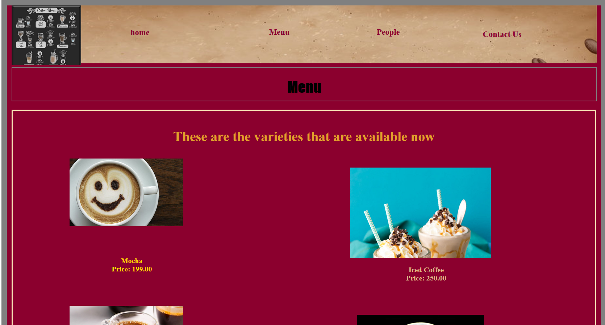
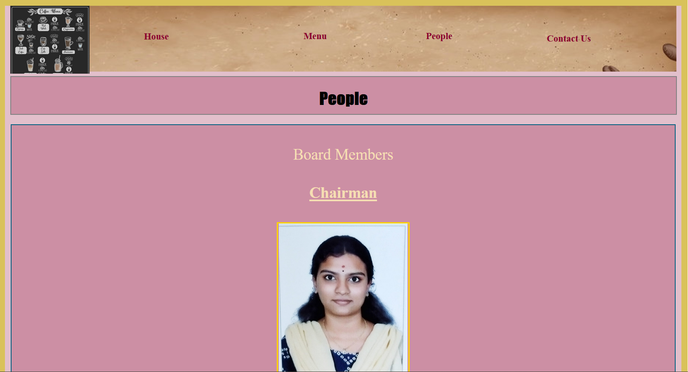
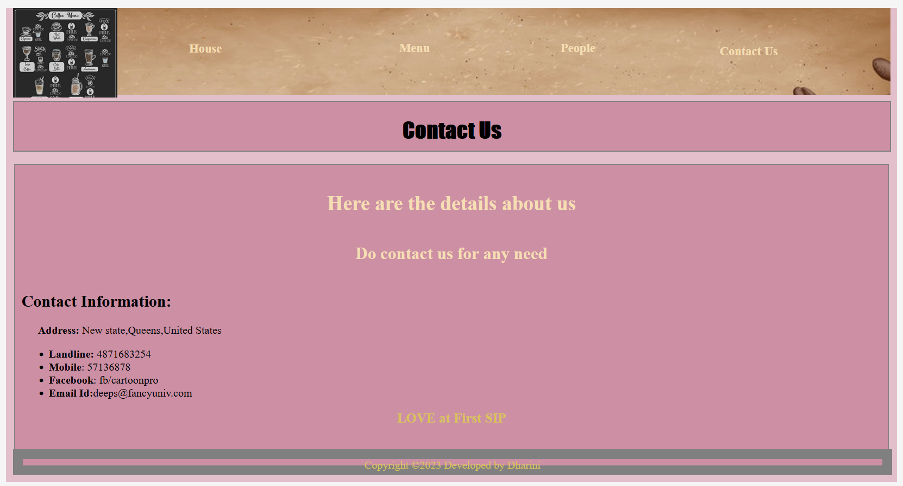
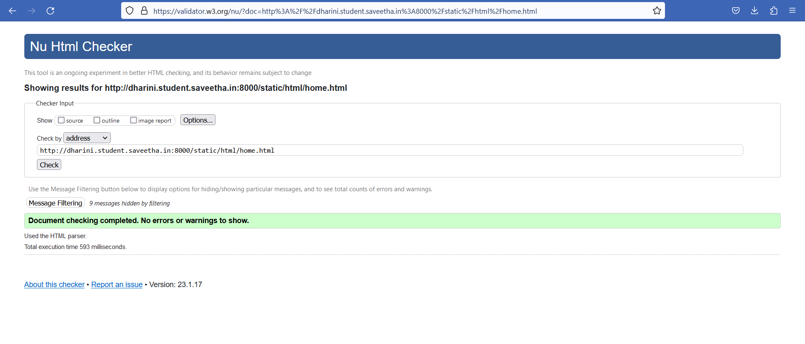

# Product Company Website
## AIM:
To develop a static company website to display the sale of products.

## Design Steps:

### Step 1:
Requirement collection.

### Step 2:
Creating the layout using HTML and CSS.

### Step 3:
Updating the sample content.

### Step 4:
Choose the appropriate style and color scheme.

### Step 5:
Validate the layout in various browsers.

### Step 6:
Validate the HTML code.

### Step 7:
Publish the website in the given URL.

## Code:
```
home.html

<!DOCTYPE html>
<html lang="en">
    <head>
        <title>
            Home Page
        </title>
        <meta name="viewport" 
         content="width=device-width, initial-scale=1.0">
        <link rel="stylesheet" href="/static/css/styles.css">
    <style>
    .text{
        color:rgb(217, 194, 90);
        font-family:'Lucida Sans';
        font-size: 30px;
        text-align:center;
    }
    img{
        height: 150px;
        width: 150px;
        align-items:center;
    }
    </style>

    </head>
    <body>
        <div class="home">
            <div class="header">
                <header>
                    <div class=logo></div>
                    <div class=h>
                    <a href="home.html" title="House" style="color: rgb(139, 0, 46); text-decoration: none;"><b>House</b></a></div>
                    <div class="prod">
                        <a href="products.html" title="Menu" style="color:  rgb(139, 0, 46); text-decoration: none;"><b>Menu</b></a>
                    </div>
                    <div class="people">
                        <a href="people.html" title="People" style="color: rgb(139, 0, 46); text-decoration: none;"><b>People</b></a>
                    </div>
                    <div class="contact">
                        <a href="contact.html" title="Contact Us" style="color:  rgb(139, 0, 46); text-decoration: none;"><b>Contact Us</b></a>
                    </div>
                </header>
                <div class="title">
                    <h1>Coffee House</h1>
                </div><br>
                <div class="content">
                    <div class="text">
                    <marquee><b></b></marquee>
                    <p style="color:rgb(217, 194, 90); font-family:'Tahoma'; font-size:20px;"> This is the Official Website of our Coffee House</p>
                    </div>
                    <p>Buy a Cup of Happiness from <span style="background-color:rgb(255, 200, 0)">Coffee House</span>
                         from Rs.50 | Buy a cup of your choice | Mobile truck | Sip many varieties | And have fun</p>
                    <br>
                <center>
                    
                    
                    
                    
                    
                    
                </center>
                </div>
                <div class="footer">
                <footer style="color:wheat">
                Copyright &copy;2023 Developed by Dharini</footer></div>
            </div>
        </div>
    </body>
</html>

products.html

<!DOCTYPE html>
<html lang="en">
    <head>
        <title>
            Products
        </title>
        <meta name="viewport" content="width=device-width, initial-scale=1.0">
        <link rel="stylesheet" href="/static/css/styles.css">
        <style>
        .home{
            height: 1555px;
            width: 85%;
            border: 12px solid grey;
            padding-left:10px;
            padding-right:10px;
            margin-left: auto;
            margin-right:auto;
            background-color:rgb(139, 0, 46);
        }
        .text{
            color:rgb(226, 162, 43);
            font-family:'Lucida Sans';
            font-size: 30px;
            text-align:center;
        
        }
        .content{
            border:3px solid wheat;
            background-color: rgb(139, 0, 46);
            width:98%;
            height:1190px;
            padding:10px;
            margin-left:auto;
            margin-right:auto;
        }
        .ph1{
            background-image: url(/static/images/item1.png);
            background-size: 250px;
            background-position-x: center;
            background-repeat: no-repeat;
            border:1px solid rgb(139, 0, 46);
            height:200px;
            width:30%;
            position:relative;
            left: 50px;
        }
        .l1{
            color: gold;
            position:relative;
            right:380px;
            
            
        }
        .ph2{
            background-image: url(/static/images/item2.png);
            background-size: 250px;
            background-position-x: center;
            background-repeat: no-repeat;
            border:1px solid rgb(139, 0, 46);
            height:200px;
            width:30%;
            position:relative;
            left: 50px;
            
        }
        .l2{
            color: sandybrown;
            position:relative;
            right:380px;
        }
        .ph3{
            background-image: url(/static/images/item3.png);
            background-size: 250px;
            background-position-x: center;
            background-repeat: no-repeat;
            border:1px solid rgb(139, 0, 46);
            height:210px;
            width:30%;
            position:relative;
            left: 50px;
            
        }
        .l3{
            color: burlywood;
            position:relative;
            right:380px;
        }
        .ph4{
            background-image: url(/static/images/item4.png);
            background-position-x: center;
            border:1px solid rgb(139, 0, 46);
            height:200px;
            width:30%;
            position:relative;
            left: 700px;
            bottom:930px;
            background-size: 310px;
            background-repeat: no-repeat;
            
            
        }
        .l4{
            color: burlywood;
            position:relative;
            left:270px;
            bottom: 930px;
        }
    
        .ph5{
            background-image: url(/static/images/item5.png);
            background-position-x: center;
            border:1px solid rgb(139, 0, 46);
            height:200px;
            width:30%;
            position:relative;
            left: 700px;
            bottom:930px;
            background-size: 280px;
            background-repeat: no-repeat;
            
            
        }
        .l5{
            color: white;
            position:relative;
            left:270px;
            bottom: 930px;
        }

        .ph6{
            background-image: url(/static/images/item6.png);
            background-position-x: center;
            border:1px solid rgb(139, 0, 46);
            height:200px;
            width:30%;
            position:relative;
            left: 700px;
            bottom:930px;
            background-size: 280px;
            background-repeat: no-repeat;
            
            
        }
        .l6{
            color:rgb(139, 0, 46);
            position:relative;
            left:270px;
            bottom: 930px;
        }
        .bot{
            text-align:center;
            font-size:larger;
            color: white;

        }
        </style>
    </head>
    <body>
        <div class="home">
            <div class="header">
                <header>
                    <div class=logo></div>
                    <div class=h>
                    <a href="home.html" title="home" style="color: rgb(139, 0, 46); text-decoration: none;"><b>home</a></div>
                    <div class="prod">
                        <a href="products.html" title="Menu" style="color: rgb(139, 0, 46); text-decoration: none;"><b>Menu</b></a>
                    </div>
                    <div class="people">
                        <a href="people.html" title="People" style="color:rgb(139, 0, 46); text-decoration: none;"><b>People</b></a>
                    </div>
                    <div class="contact">
                        <a href="contact.html" title="Contact Us" style="color:rgb(139, 0, 46); text-decoration: none;"><b>Contact Us</b></a>
                    </div>
                </header>
                <div class="title">
                    <h1>Menu</h1>
                </div><br>
                <div class="content">
                    <div class="text">
                    <p>These are the varieties that are available now</p>
                    </div>
                    <div class="ph1"></div>
                    <div class="l1"><p align="center"><b>Mocha<br> Price: 199.00</b><br><br><br><br></p></div>
                    <div class="ph2"></div>
                    <div class="l2"><p align="center"><b>Expresso<br> Price: 100.00</b><br><br><br><br></p></div>
                    <div class="ph3"></div>
                    <div class="l3"><p align="center"><b>Capuccino<br> Price: 200.00</b><br<br><br><br></p></div>
                    <div class="ph4"></div>
                    <div class="l4"><p align="center"><b>Iced Coffee<br> Price: 250.00</b><br><br><br><br></p></div>
                    <div class="ph5"></div>
                    <div class="l5"><p align="center"><b>Degree Coffee<br> Price: 80.00</b><br><br><br><br></p></div>
                    <div class="ph6"></div>
                    <div class="l6"><p align="center"><b>Black Coffee<br> Price: 50.00</b><br><br><br><br></p></div>
         
                </div>
                <div class="bot"><p>To Order : Call 90 80 70 2009</p></div>

                <div class="footer">
                <footer style="color:white">
                Copyright &copy;2023 Developed by Dharini</footer></div>
            </div>
        </div>
    </body>
</html>

people.html

<!DOCTYPE html>
<html lang="en">
    <head>
        <title>
            Products
        </title>
        <meta name="viewport" content="width=device-width, initial-scale=1.0">
        <link rel="stylesheet" href="/static/css/styles.css">
        <style>
        .home{
            height: 1555px;
            width: 85%;
            border: 12px solid grey;
            padding-left:10px;
            padding-right:10px;
            margin-left: auto;
            margin-right:auto;
            background-color:rgb(139, 0, 46);
        }
        .text{
            color:rgb(226, 162, 43);
            font-family:'Lucida Sans';
            font-size: 30px;
            text-align:center;
        
        }
        .content{
            border:3px solid wheat;
            background-color: rgb(139, 0, 46);
            width:98%;
            height:1190px;
            padding:10px;
            margin-left:auto;
            margin-right:auto;
        }
        .ph1{
            background-image: url(/static/images/item1.png);
            background-size: 250px;
            background-position-x: center;
            background-repeat: no-repeat;
            border:1px solid rgb(139, 0, 46);
            height:200px;
            width:30%;
            position:relative;
            left: 50px;
        }
        .l1{
            color: gold;
            position:relative;
            right:380px;
            
            
        }
        .ph2{
            background-image: url(/static/images/item2.png);
            background-size: 250px;
            background-position-x: center;
            background-repeat: no-repeat;
            border:1px solid rgb(139, 0, 46);
            height:200px;
            width:30%;
            position:relative;
            left: 50px;
            
        }
        .l2{
            color: sandybrown;
            position:relative;
            right:380px;
        }
        .ph3{
            background-image: url(/static/images/item3.png);
            background-size: 250px;
            background-position-x: center;
            background-repeat: no-repeat;
            border:1px solid rgb(139, 0, 46);
            height:210px;
            width:30%;
            position:relative;
            left: 50px;
            
        }
        .l3{
            color: burlywood;
            position:relative;
            right:380px;
        }
        .ph4{
            background-image: url(/static/images/item4.png);
            background-position-x: center;
            border:1px solid rgb(139, 0, 46);
            height:200px;
            width:30%;
            position:relative;
            left: 700px;
            bottom:930px;
            background-size: 310px;
            background-repeat: no-repeat;
            
            
        }
        .l4{
            color: burlywood;
            position:relative;
            left:270px;
            bottom: 930px;
        }
    
        .ph5{
            background-image: url(/static/images/item5.png);
            background-position-x: center;
            border:1px solid rgb(139, 0, 46);
            height:200px;
            width:30%;
            position:relative;
            left: 700px;
            bottom:930px;
            background-size: 280px;
            background-repeat: no-repeat;
            
            
        }
        .l5{
            color: white;
            position:relative;
            left:270px;
            bottom: 930px;
        }

        .ph6{
            background-image: url(/static/images/item6.png);
            background-position-x: center;
            border:1px solid rgb(139, 0, 46);
            height:200px;
            width:30%;
            position:relative;
            left: 700px;
            bottom:930px;
            background-size: 280px;
            background-repeat: no-repeat;
            
            
        }
        .l6{
            color:rgb(139, 0, 46);
            position:relative;
            left:270px;
            bottom: 930px;
        }
        .bot{
            text-align:center;
            font-size:larger;
            color: white;

        }
        </style>
    </head>
    <body>
        <div class="home">
            <div class="header">
                <header>
                    <div class=logo></div>
                    <div class=h>
                    <a href="home.html" title="home" style="color: rgb(139, 0, 46); text-decoration: none;"><b>home</a></div>
                    <div class="prod">
                        <a href="products.html" title="Menu" style="color: rgb(139, 0, 46); text-decoration: none;"><b>Menu</b></a>
                    </div>
                    <div class="people">
                        <a href="people.html" title="People" style="color:rgb(139, 0, 46); text-decoration: none;"><b>People</b></a>
                    </div>
                    <div class="contact">
                        <a href="contact.html" title="Contact Us" style="color:rgb(139, 0, 46); text-decoration: none;"><b>Contact Us</b></a>
                    </div>
                </header>
                <div class="title">
                    <h1>Menu</h1>
                </div><br>
                <div class="content">
                    <div class="text">
                    <p>These are the varieties that are available now</p>
                    </div>
                    <div class="ph1"></div>
                    <div class="l1"><p align="center"><b>Mocha<br> Price: 199.00</b><br><br><br><br></p></div>
                    <div class="ph2"></div>
                    <div class="l2"><p align="center"><b>Expresso<br> Price: 100.00</b><br><br><br><br></p></div>
                    <div class="ph3"></div>
                    <div class="l3"><p align="center"><b>Capuccino<br> Price: 200.00</b><br<br><br><br></p></div>
                    <div class="ph4"></div>
                    <div class="l4"><p align="center"><b>Iced Coffee<br> Price: 250.00</b><br><br><br><br></p></div>
                    <div class="ph5"></div>
                    <div class="l5"><p align="center"><b>Degree Coffee<br> Price: 80.00</b><br><br><br><br></p></div>
                    <div class="ph6"></div>
                    <div class="l6"><p align="center"><b>Black Coffee<br> Price: 50.00</b><br><br><br><br></p></div>
         
                </div>
                <div class="bot"><p>To Order : Call 90 80 70 2009</p></div>

                <div class="footer">
                <footer style="color:white">
                Copyright &copy;2023 Developed by Dharini</footer></div>
            </div>
        </div>
    </body>
</html>

contact.html

styles.css

        .home{
            height: 700px;
            width: 85%;
            border: 12px solid whitesmoke;
            padding-left:10px;
            padding-right:10px;
            margin-left: auto;
            margin-right:auto;
            background-color: rgba(139, 0, 46, 0.252);
        }
        .content{
            border:1px solid whitesmoke;
            background-color:  rgba(139, 0, 46, 0.252);
            width:95%;
            height:1190px;
            padding:10px;
            margin-left:auto;
            margin-right:auto;
        }
        .header{
            height: 128px;
            width:100%;
            background-image: url(/static/images/header.png);
            background-size: cover;
            
        }
        .logo{
            height:18%;
            width: 10%;
            position:absolute;
            background-image: url(/static/images/icon.png);
            background-size:cover;
            
        }
        .prod{
            height:auto;
            width:auto;
            position:relative;
            bottom:10px;
            left:550px;
            border:4px solid transparent;
            text-align:center;
            display: inline;
            padding:15px;
            font-family:'Gill Sans MT';
            font-size: large;  
        }
        .prod:hover{
            background-color: rgba(139, 0, 46, 0.252);
        }
        .people{
            height:auto;
            width:auto;
            position:relative;
            bottom:10px;
            left:700px;
            border:4px solid transparent;
            text-align:center;
            display: inline;
            padding:15px;
            font-family:'Gill Sans MT';
            font-size: large;  
        }
        .people:hover{
            background-color: rgba(139, 0, 46, 0.252);
        }
        .contact{
            height:20px;
            width:10%;
            position:relative;
            bottom:45px;
            left:1000px;
            border:4px solid transparent;
            text-align:center;
            padding:15px;
            font-family:'Gill Sans MT';
            font-size: large;  
        }
        .contact:hover{
            background-color: rgba(139, 0, 46, 0.252);
        }
                
        .h{
            height:20px;
            width:10%;
            position:relative;
            top:30px;
            left:200px;
            border:4px solid transparent;
            text-align:center;
            
            padding:15px;
            font-family:'Gill Sans MT';
            font-size: large;  
        }
        .h:hover{
            background-color:  rgba(139, 0, 46, 0.252);
            overflow:hidden;
        }
        .footer{
            border: 15px solid grey;
            width:98%;
            height:10px;
            position:relative;
            bottom: 1px;
            background-color:  rgba(139, 0, 46, 0.252);
            text-align:center;

        }
        .title{
            border:2px solid grey;
            background-color: rgba(139, 0, 46, 0.252);
            padding:1px;
            width:99.7%;
            height: 70px;
            text-align:center;
            font-family:'Impact';
            margin-left:auto;
            margin-right: auto;
            
        }
        .content{
            border:1px solid grey;
            background-color: rgba(139, 0, 46, 0.252);
            width:98%;
            height:400px;
            padding:10px;
            margin-left:auto;
            margin-right:auto;

        }
```

## Output:






## HTML Validator


## Result:
The program for designing company website for sale of products using HTML and CSS is completed successfully.